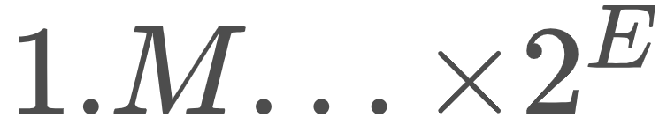
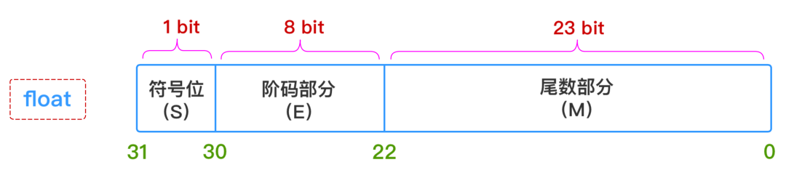
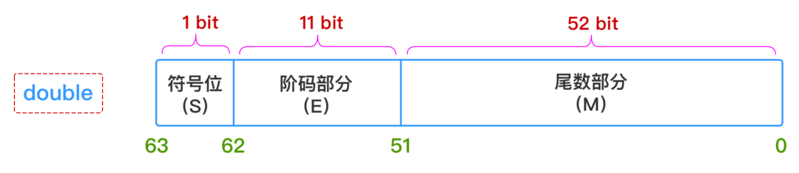
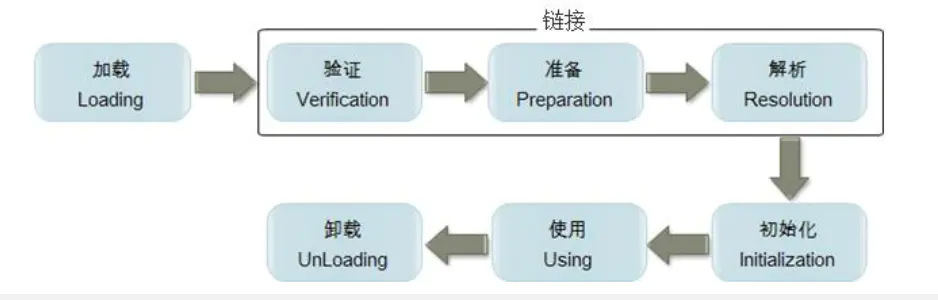

# 关键字

| 关键字       | 含义                                         |
| ------------ | -------------------------------------------- |
| abstract     | 抽象类或方法                                 |
| assert       | 用来查找内部程序错误                         |
| break        | 跳出一个switch或循环                         |
| byte         | 8位整数类型                                  |
| case         | switch的一个分支                             |
| catch        | 捕获异常的try块子句                          |
| class        | 定义一个类类型                               |
| continue     | 在循环末尾继续                               |
| default      | switch的缺省语句                             |
| do           | do/while循环最前面的语句                     |
| double       | 双精度浮点数类型                             |
| else         | if语句的else子句                             |
| enum         | 枚举类型                                     |
| extends      | 定义一个类的父类                             |
| final        | 一个常量，或不能覆盖的一个类或方法           |
| finally      | try块中总会执行的部分                        |
| float        | 单精度浮点数类型                             |
| for          | 一个循环类型                                 |
| if           | 一个条件语句                                 |
| implements   | 定义一个类实现的接口                         |
| import       | 导入一个包                                   |
| instanceof   | 测试一个对象是否是某个类的实例               |
| int          | 32位整型数                                   |
| interface    | 接口，一种抽象类型，仅有方法和常量的定义     |
| long         | 64位长整数型                                 |
| native       | 由宿主系统实现的一个方法                     |
| new          | 分配新的类实例                               |
| null         | 一个空引用                                   |
| package      | 包含类的一个包                               |
| private      | 表示私有字段，或者方法等，只能从类内部访问   |
| protected    | 表示保护类型字段                             |
| public       | 表示共有属性或者方法                         |
| return       | 从一个方法中返回                             |
| short        | 16位整数类型                                 |
| static       | 这个特性是这个类特有的，而不属于这个类的对象 |
| strictfp     | 对浮点数计算使用严格的规则                   |
| super        | 超类对象或构造函数                           |
| switch       | 选择语句                                     |
| synchronized | 对线程而言是原子的方法或代码块               |
| this         | 当前类的一个方法或构造函数的隐含参数         |
| throw        | 抛出一个异常                                 |
| throws       | 一个方法可能抛出的异常                       |
| transient    | 标志非永久性的数据                           |
| try          | 捕获异常的代码块                             |
| void         | 标记方法不返回任何值                         |
| volatile     | 标记字段可能会被多个线程同时访问，而不做同步 |
| while        | 一种循环                                     |

# 数据类型

## 基本类型

#### 如何理解基本类型不能作为泛型类型？

> 比如，我们没有`ArrayList<int>`，只有`ArrayList<Integer>`, 为何？

因为当类型擦除后，ArrayList的原始类型变为Object，但是Object类型不能存储int值，只能引用Integer的值。

另外需要注意，我们能够使用`list.add(1)`是因为Java基础类型的自动装箱拆箱操作。

### **整数类型**

#### 补码

二进制用补码表示。

负数的反码是在其原码的基础上, 符号位不变，其余各个位取反.

负数的补码是在其原码的基础上, 符号位不变, 其余各位取反, 最后+1. (即在反码的基础上+1)

整数型用来存储整数数值，即没有小数部分的数值。可以是正数，也可以是负数。整数数据在Java程序中有3种表示形式，分别为[十进制](https://baike.baidu.com/item/十进制?fromModule=lemma_inlink)、[八进制](https://baike.baidu.com/item/八进制?fromModule=lemma_inlink)和十六进制。

#### 类型

整型数据根据它所占内容大小的不同可分为4种类型。默认为int

| 数据类型 | 内存 |
| -------- | ---- |
| byte     | 8位  |
| short    | 16位 |
| int      | 32位 |
| long     | 64位 |

#### 隐式转换

```java
byte bb = 10;
short ss = bb;
int ii = bb;
long ll = ii;
```

#### Java 中负数的绝对值不⼀定是正数？

绝对值是指一个数在数轴上所对应点到原点的距离，所以，在数学领域，正数的绝对值是这个数本身，负数的绝对值应该是他的相反数。

这几乎是每个人都知道的。

在Java中，想要获得有个数字的绝对值，可以使用java.lang.Math中的abs方法，这个类共有4个重载的abs方法，分别是：

```php
 public static int abs(int a) {
        return (a < 0) ? -a : a;
    }
    public static long abs(long a) {
        return (a < 0) ? -a : a;
    }
    public static float abs(float a) {
        return (a <= 0.0F) ? 0.0F - a : a;
    }
    public static double abs(double a) {
        return (a <= 0.0D) ? 0.0D - a : a;

    }
```

以上4个方法分别返回int、long、float、double类型的绝对值，方法里面的逻辑也简单，**无非就是整数直接返回，负数取相反数返回**。

所以，基于以上所有的知识，我们经常会直接使用Math.abs来对一个数字取绝对值。

在我们的代码中，也有很多这样的例子。

比如，我们需要用订单号做分库分表，但是订单号是[字符串](https://so.csdn.net/so/search?q=字符串&spm=1001.2101.3001.7020)类型，所以，我们就需要取得这个字符换的hashCode，因为**hashCode可能是负数**，所以然后再对hashCode取绝对值，再用这个值去对分表数取模：

```php
  Math.abs(orderId.hashCode()) % 1024;
```

但是，**上面这个逻辑是有问题的！！！**

因为在极特殊情况下，上面的代码会得到一个负数的值。

这个极特殊情况下就是当hashCode是Integer.MIN_VALUE，即整数能表达的最小值的时候，可以代码验证下：

```php
  public static void main(String[] args) {
 System.out.println(Math.abs(Integer.MIN_VALUE));
  }
```

执行以上代码，得到的结果是：

```php
  -2147483648
```

很明显，这是个**负数**！！！

**为什么会这样呢？**

这要从Integer的取值范围说起，int的取值范围是-2^31 —— (2^31) - 1，即-2147483648 至 2147483647

那么，当我们使用abs取绝对值时候，想要取得-2147483648的绝对值，那应该是2147483648。

但是，2147483648大于了2147483647，即超过了int的取值范围。这时候就会发生越界。

2147483647用二进制的补码表示是：

01111111 11111111 11111111 11111111 

这个数 +1 得到：

10000000 00000000 00000000 00000000 

这个二进制就是-2147483648的补码。

虽然，这种情况发生的概率很低，**只有当要取绝对值的数字是-2147483648的时候，得到的数字还是个负数。**

那么，**如何解决这个问题呢？**

既然是以为越界了导致最终结果变成负数，那就**解决越界的问题**就行了，那就是在取绝对值之前，把这个int类型转成long类型，这样就不会出现越界了。

如，前面我们的分表逻辑修改为

```php
 Math.abs((long)orderId.hashCode()) % 1024; 
```

就万无一失了。

大家可以执行下以下代码：

```java
public static void main(String[] args) {
      System.out.println(Math.abs((long)Integer.MIN_VALUE));

  }
```

得到的结果就是：

```php
 2147483648
```

### **浮点类型**

#### **IEEE 754** 



只要给出：**符号（S）**、**阶码部分（E）**、**尾数部分（M）** 这三个维度的信息，一个浮点数的表示就完全确定下来了，所以`float`和`double`这两种浮点数在内存中的存储结构如下所示：






**1、符号部分（S）**

`0`-正  `1`-负

**2、阶码部分（E）（指数部分）**：

- 对于`float`型浮点数，指数部分`8`位，考虑可正可负，因此可以表示的指数范围为`-127 ~ 128`
- 对于`double`型浮点数，指数部分`11`位，考虑可正可负，因此可以表示的指数范围为`-1023 ~ 1024`

**3、尾数部分（M）**：

浮点数的精度是由尾数的位数来决定的：

- 对于`float`型浮点数，尾数部分`23`位，换算成十进制就是 `2^23=8388608`，所以十进制精度只有`6 ~ 7`位；
- 对于`double`型浮点数，尾数部分`52`位，换算成十进制就是 `2^52 = 4503599627370496`，所以十进制精度只有`15 ~ 16`位

所以对于上面的数值`0.99999999f`，很明显已经超过了`float`型浮点数据的精度范围，出问题也是在所难免的。

#### 转换示例

浮点数是我们在程序里常用的数据类型，它在内存中到底是怎么样的形式存在，是我了解之前是觉得好神奇，以此记录，作为学习笔记并分享。

现代计算机中，一般都以IEEE 754标准存储浮点数，这个标准的在内存中存储的形式为：


对于不同长度的浮点数，阶码与小数位分配的数量不一样，如下：


对于32位的单精度浮点数，数符分配是1位，阶码分配了8位，尾数分配了是23位。

根据这个标准，我们来尝试把一个十进制的浮点数转换为IEEE754标准表示。

例如：178.125

1. 先把浮点数分别把整数部分和小数部分转换成2进制

2. 1. 整数部分用除2取余的方法，求得：10110010
   2. 小数部分用乘2取整的方法，求得：001
   3. 合起来即是：10110010.001
   4. 转换成二进制的浮点数，即把小数点移动到整数位只有1，即为：1.0110010001 * 2^111，111是二进制，由于左移了7位，所以是111

3. 把浮点数转换二进制后，这里基本已经可以得出对应3部分的值了

4. 1. 数符：由于浮点数是正数，故为0.(负数为1)
   2. 阶码 : 阶码的计算公式：阶数 + 偏移量, 阶码是需要作移码运算，在转换出来的二进制数里，阶数是111(十进制为7)，对于单精度的浮点数，偏移值为01111111(127)[偏移量的计算是：2^(e-1)-1, e为阶码的位数，即为8，因此偏移值是127]，即：111+01111111 = 10000110
   3. 尾数：小数点后面的数，即0110010001
   4. 最终根据位置填到对位的位置上：


可能有个疑问：小数点前面的1去哪里了？由于尾数部分是规格化表示的，最高位总是“1”，所以这是直接隐藏掉，同时也节省了1个位出来存储小数，提高精度。

#### Java浮点数

浮点数默认为double.舍入误差的主要原因是浮点数值采用二进制系统表示，而在二进制系统中无法精确地表示分数1/10。

| 数据类型 | 内存 |
| -------- | ---- |
| float    | 32位 |
| double   | 64位 |

### **字符类型**

#### Unicode码

char采用**Unicode码** 每个char型变量占用2byte的内存空间，正好可以表示Unicode码下的所有字符。

#### Java字符

字符类型用于存储单个字符，占用16位（两个字节）的内存空间。在定义字符型变量时，要以单引号表示。使用[char](https://baike.baidu.com/item/char/5156054?fromModule=lemma_inlink)关键字可定义字符变量。

| 数据类型 | 内存 |
| -------- | ---- |
| char     | 16位 |

### **布尔类型**

布尔类型又称逻辑类型，通过关键字[boolean](https://baike.baidu.com/item/boolean?fromModule=lemma_inlink)来定义布尔类型变量，只有只有true和false两个取值，分别代表布尔逻辑中的“真”和“假”。布尔类型通常被用在流程控制中作为判断条件。一般扩充为一个字节表示。

## 引用类型

除了基本类型都是引用类型。**但是都是值传递**。

### 类，接口

### 数组

# 运算符

## 一元运算符

++   --   针对整数类型

## 二元运算符

### 比较运算符

obj  instance of  CLASSTYPE

== 

**>**

<

### 算术运算符

**+   -    *     /     %       ++    --**

### 逻辑运算符

&&   ||    

短路特性·   一旦前面成立不会运算后面

### 位运算符

&    |   位运算符允许我们操作一个**整型**数字中的单个二进制位。位运算符会对两个整数 对应的位执行布尔代数，从而产生结果。

### 移位运算符


它们只能用于处理**整数**类型。 如果移动 char、byte 或 short，则会在移动发生之前将其提升为 int，结果为 int。若对 一个 long 值进行处理，最后得到的结果也是 long

**<<**   能将其左边的运算对象向左移动右侧指定的位数（在 低位补 0）。

**>>**   右移位运算符有 “正”、“负” 值：若值为正，则 在高位插入 0；若值为负，则在高位插入 1

**>>>**，它使用了 “零扩展”（zero extension）：无论正负，都在高位插入 0。

## 三元运算符

布尔表达式? 值 1 : 值 2

## 字符串运算符

**+**  底层是StringBuilder.append()

## 类型转换

### 允许操作的范围

除了布尔类型的数据，Java 允许任何基本类型的数据转换为另一种基本类型的数 据。

为了将一个类转换为另一个类型，需要显示声明。

### 向下转换

（Narrowing Conversion）的操作（将容量较大的数据类型转换成容量较小 的类型），可能会发生信息丢失的危险。

#### 截断和舍入

从 float 和 double 转换为整数值时，小数位将被截断。若你想对 结果进行四舍五入，可以使用 java.lang.Math 的 round() 方法。

### 向上转换

（Widening conversion），则不必进行显式的类型转换，因为较大类 型的数据肯定能容纳较小类型的数据，不会造成任何信息的丢失。

### 类型提升为int

如果我们对小于 int 的基本数据类型（即 char、byte 或 short）执行 任何**算术或按位**操作，这些值会在执行操作之前类型提升为 int，并且结果值的类型为 int。

# 控制流

## 顺序

根据代码行自上而下执行。 

## 循环

```java
for(){

continue;// 跳出此次循环  开启下一次循环

break;// 打破循环 执行循环结构体下语句

}
```

```java
do{
continue;// 跳出此次循环  开启下一次循环

break;// 打破循环 执行循环结构体下语句
}while()
```

```java
while(){
continue;// 跳出此次循环  开启下一次循环

break;// 打破循环 执行循环结构体下语句
}
```

### 标签

“标签” 是后面跟一个冒号的标识符。 

eg:

inner: // 此处不允许存在执行语句

outer: // 此处不允许存在执行语句

### continue 

1、会退回最内层循环的开头（顶部），并继续执行。 

2、带有标签的 continue 会到达标签的位置，并重新进入紧接在那个标签后面的循 环。 

### break

1、break 会中断当前循环，并移离当前标签的末尾。 

2、带标签的 break 会中断当前循环，并移离由那个标签指示的循环的末尾。 大家要记住的重点是：在 Java 里需要使用标签的唯一理由就是因为有循环嵌套存 在，而且想从多层嵌套中 break 或 continue。

## 分支

### if-else

```java
if-else
```

### switch

var  为整数类型。可以扩展到String，枚举类型，javap查看其本质为hashCode().

```java
switch(var):

case   value1:

break;

 case   value2:

break;

default:

break;
```

# 变量类型



**init是instance实例构造器，对非静态变量解析初始化**

**clinit是class类构造器对静态变量，静态代码块进行初始化**。

## static变量

类加载的准备阶段正式为类变量(static变量)分配内存并设置类变量初始值的阶段，这些内存都将在方法区中进行分配。注意此时的设置初始值为默认值。生命周期和类一致。

类初始化阶段为具体赋值。

### 常量

#### 定义

通过static   final定义。

#### 赋值

定义时赋值，读取时不会加载该类。

static{}初始化类常量，在读取该变量时会加载这个类。

在类常量池，存储在方法区。

#### 读取

通过类名.变量名读取。

### 类变量

static 修饰。声明在类里，但在方法和其他语句块之外。属于类，所有实例共用。

#### 赋值

定义时赋值；静态代码块赋值;或者不初始化，在其他引用时赋值，这时初始化会被赋零值。

定义时赋值也会被优化到在static{}里面初始化。

#### 读取

通过类名.变量名读取。

## 实例变量

生命周期和对象一致。

### 实例常量

#### 赋值

关键字final表示这个变量只能被赋值一次。

要么在定义时；要么在初始化代码里面赋值；要么在构造函数。

经过javap 反编译后发现即使，初始化赋值或者写在初始化代码里面会被优化到构造函数赋值的。

### 实例变量

声明在类里，但在方法和其他语句块之外 。属于实例对象，每个对象一份。经过javap 反编译后发现即使写在初始化{}里面会被优化到构造函数赋值的。

#### 赋值

定义时赋值；静态代码块赋值；构造函数赋值，其他地方赋值。

## 方法变量

方法内声明，方法内生效。生命周期为方法内。

## 局部变量

代码块在{}，for循环时声明，只在方}前生效。生命周期为代码块内。

# 构造函数

构造函数与类同名，无返回值。

默认提供无参构造函数。

重载  可以自己提供多个构造函数。

# 方法

## 静态方法

staic修饰，可以直接用类名调用。

## 实例方法

只能被实例化的对象调用。

## final方法

子类不可修改。

# 代码块

**clinit是class类构造器对静态变量，静态代码块进行初始化**

初始化块分为静态初始化块和普通初始化块。其好处是减少多个构造器内重用的代码；常量会被自动优化到构造函数里面。

## 静态块

类加载时隐式调用，当使用类常量时不会加载类，所以不会调用静态初始化块。

静态初始化块只调用一次（类加载时）。

可以初始化类变量，但会被优化到构造函数执行。

## 实例块

创建对象时隐式调用。

普通初始化块可以调用多次，随着对象的创建而加载。

可以初始化实例变量，但会被优化到构造函数执行。

## 本地方法块

在方法里{}  里面的变量生命周期只到}。每次随方法执行。

# 内部类

```java
/**
 * @Desc:
 * @Author 吴想想
 * @Date 2022/9/10
 */
public class Outer {

    private Integer i;

    private static Integer si;

    static class StaticInner{
        final static Integer inSi = 10;
    }

    class Inner {

        Outer out() {
            i ++;
            return Outer.this;
        }

        Inner in() {
            return this;
        }

        // 匿名内部类
        Comparable fun1(){
            return new Comparable(){
                @Override
                public int compareTo(Object o) {
                    return 0;
                }
            };
        }

        // 局部内部类
        Comparable fun2(){
            class IntegerComparable implements Comparable<Integer>{
                @Override
                public int compareTo(Integer o) {
                    return 0;
                }
            }
            Comparable ic = new IntegerComparable();
            return ic;
        }

    }
}

```

## 内存泄漏

若内部类持有外部类的引用，对内部类的使用很多时，会导致外部类数目很多。此时，就算是外部类的数据没有被用到，外部类的数据所占空间也不会被释放。本处在外部类存放大量的数据来模拟。

```java
package org.example.a;

import java.util.ArrayList;
import java.util.List;

class Outer{
    private int[] data;

    public Outer(int size) {
        this.data = new int[size];
    }
     
    class Innner{
     
    }
     
    Innner createInner() {
        return new Innner();
    }

}

public class Demo {
    public static void main(String[] args) {
        List<Object> list = new ArrayList<>();
        int counter = 0;
        while (true) {
            list.add(new Outer(100000).createInner());
            System.out.println(counter++);
        }
    }
}
```

### 解决方案

内部类改为静态的之后，它所引用的对象或属性也必须是静态的，所以静态内部类无法获得外部对象的引用，只能从 JVM 的 Method Area（方法区）获取到 static 类型的引用。

## 静态内部类

在外部类定义，并static修饰。不能访问外部类的实例变量。能包含静态变量。

### 命名

命名为 Outer$StaticInner.class.

### 引用外部类static属性

自动在外部类类属性添加，即类似于set  get 方法：

 static java.lang.Integer access$000(Outer);

 static java.lang.Integer access$002(Outer, java.lang.Integer);


## 实例内部类

在外部类定义，能访问外部类的实例变量。不能定义静态变量。

### 命名

命名规律Outer$Inner.class。

### 创建.new

```java
Out out = new Out();
Out.Inner in = out.new Inner();
```

### 引用外部类OutClass.this

## 局部内部类

可以在代码块里创建内部类，典型的方式是在一个方法体的里面创 建。

### 命名

Outer$Inner$1IntegerComparable.class

## 匿名内部类

只使用一次，无须名字。

1、 实现了某类型的接口，于是可以创建并返回对其的引用。 

2、实现一个抽象类。

### 命名

Outer$Inner$1.class

## 内部类标识符

**javac**编译后每个类都会产生一个 .class 文件，其中包含了如何创建该类型的对象 的全部信息（此信息产生一个 “meta-class”，叫做 Class 对象）。 你可能猜到了，内部类也必须生成一个 .class 文件以包含它们的 Class 对象信息。 这些类文件的命名有严格的规则：可通过**javap**查看外部类的名字，例 如，LocalInnerClass.java 生成的 .class 文件包括： 

Counter.class LocalInnerClass$1.class LocalInnerClass$LocalCounter.class LocalInnerClass.class 如果内部类是匿名的，编译器会简单地产生一个数字作为其标识符。如果内部类是 嵌套在别的内部类之中，只需直接将它们的名字加在其外部类标识符与 “$” 的后面。

# 面向对象

## 封装

### 定义

即隐藏对象的属性和实现细节，仅对外公开接口，控制在程序中属性的读和修改的访问级别；将抽象得到的数据和行为（或功能）相结合，形成一个有机的整体，也就是将[数据](https://baike.baidu.com/item/数据/5947370?fromModule=lemma_inlink)与操作数据的[源代码](https://baike.baidu.com/item/源代码/3814213?fromModule=lemma_inlink)进行有机的结合，形成“类”，其中数据和函数都是类的成员。

### 实现方式

通过权限关键字控制。

| 修饰词     | 本类 | 同一个包的类 | 继承类 | 其他类 |
| ---------- | ---- | ------------ | ------ | ------ |
| private    | √    | ×            | ×      | ×      |
| 无（默认） | √    | √            | ×      | ×      |
| protected  | √    | √            | √      | ×      |
| public     | √    | √            | √      | √      |

## 继承（扩展更合适）

### 定义

继承可以使得子类具有父类的[属性](https://baike.baidu.com/item/属性/20192958?fromModule=lemma_inlink)和[方法](https://baike.baidu.com/item/方法/3009352?fromModule=lemma_inlink)或者重新定义、追加属性和方法等。

### 实现方式

extends

implements

### 构造函数

Java的子类不能获得父类的构造器。所以要在构造函数显性写出父类的构造函数初始化父类。

super  super()

this   this()

### 属性

可以获得protect   public属性。

### 方法

可以获得protect   public方法。

## 多态

指为不同[数据类型](https://baike.baidu.com/item/数据类型?fromModule=lemma_inlink)的实体提供统一的[接口](https://baike.baidu.com/item/接口?fromModule=lemma_inlink)。 **多态类型**（英语：polymorphic type）可以将自身所支持的操作套用到其它类型的值上。

### 重载

指的是在同一个类中，多个函数或者方法有同样的名称，但是参数列表不相同的情形，这样的同名不同参数的函数或者方法之间，互相称之为重载函数或者方法。

### 覆盖

指的是在Java的子类与父类中有两个名称、参数列表都相同的方法的情况。由于他们具有相同的方法签名，所以子类中的新方法将覆盖父类中原有的方法。

## **抽象**

### 抽象定义

“抽象只从正确的角度，透露对象的某些相关细节。”

在面向对象编程理论中，抽象涉及到定义抽象对象的语言基础，它到底如何工作、如何获取和改变状态，并与系统中的其他对象进行“交流”。

抽象在任何编程语言中的许多方面起作用。从创建子程序到定义接口来，生成低级语言调用，例如设计模式。

 

### **抽象的形式**

通常抽象有两种形式：

#### 1) 数据抽象

数据抽象是创建复杂数据类型，只公开与数据类型交互有意义的操作，对外界隐藏了所有实现细节。

这种方法的好处包括随着时间的推移改进实现的能力，例如解决性能问题。其思想是，这些更改不应对客户机代码产生任何影响，因为它们不涉及抽象行为。

#### **2)** **控制抽象**

软件本质上是用任何编程语言编写的大量语句的集合。大多数情况下，语句都是相似的，多次重复。

控制抽象是识别所有这些语句并将其作为一个工作单元展现的过程（提取方法）。当我们创建一个函数来执行任何工作时，我们通常就是在抽象

### 抽象类

定义了一个类的共性属性，方法。

abstract修饰的类，可以有虚方法，子类必须完全实现父类虚方法。

### 接口

接口定义了实现类需要遵守的契约。这些契约本质上是未实现的方法。Java已经有一个针对未实现的方法的关键词即*abstract*。Java已经提供的任何类都可以实现任何接口，所有接口中声明的方法只能是public。

# Object

所有对象继承自Object。

```java

public class Object {
    public Object() {
    }

    private static native void registerNatives();

    public final native Class<?> getClass();

    public native int hashCode();

    public boolean equals(Object obj) {
        return this == obj;
    }

    protected native Object clone() throws CloneNotSupportedException;

    public String toString() {
        return this.getClass().getName() + "@" + Integer.toHexString(this.hashCode());
    }

    public final native void notify();

    public final native void notifyAll();

    public final native void wait(long var1) throws InterruptedException;

    public final void wait(long timeout, int nanos) throws InterruptedException {
        if (timeout < 0L) {
            throw new IllegalArgumentException("timeout value is negative");
        } else if (nanos >= 0 && nanos <= 999999) {
            if (nanos > 0) {
                ++timeout;
            }

            this.wait(timeout);
        } else {
            throw new IllegalArgumentException("nanosecond timeout value out of range");
        }
    }

    public final void wait() throws InterruptedException {
        this.wait(0L);
    }

    protected void finalize() throws Throwable {
    }

    static {
        registerNatives();
    }
}
```

## equals

指示其他对象是否“等于”这个对象。
equals方法在非空对象引用上实现等价关系：

### 自反的：

对于任何非空引用值x ， x.equals(x)应该返回true 。
它是对称的：对于任何非空引用值x和y ，当且仅当y.equals(x)返回true时， x.equals(y)才应该返回true 。

### 可传递：

对于任何非空引用值x 、 y和z ，如果x.equals(y)返回true并且y.equals(z)返回true ，则x.equals(z)应该返回true 。

### 一致的：

对于任何非空引用值x和y ， x.equals(y)的多次调用始终返回true或始终返回false ，前提是没有修改对象上equals比较中使用的信息。
对于任何非空引用值x ， x.equals(null)应该返回false 。
Object类的equals方法实现了对象上最有区别的可能等价关系；也就是说，对于任何非空引用值x和y ，当且仅当x和y引用同一个对象（ x == y的值为true ）时，此方法才返回true 。
请注意，每当重写该方法时，通常都需要重写hashCode方法，以维护hashCode方法的一般约定，即相等的对象必须具有相等的哈希码。
参数：
obj - 要与之比较的参考对象。
回报：
如果此对象与 obj 参数相同，则为true ；否则false 

## hashCode()

返回对象的哈希码值。支持此方法是为了有利于哈希表，例如java.util.HashMap提供的哈希表。
hashCode的一般合约是：
**每当在 Java 应用程序执行期间对同一个对象多次调用它时， hashCode方法必须始终返回相同的整数，前提是没有修改对象上的equals比较中使用的信息**。该整数不需要从应用程序的一次执行到同一应用程序的另一次执行保持一致。
如果两个对象根据equals(Object)方法相等，则对两个对象中的每一个调用hashCode方法必须产生相同的整数结果。
如果根据equals(Object)方法，如果两个对象不相等，则不需要对两个对象中的每一个调用hashCode方法都必须产生不同的整数结果。但是，程序员应该意识到，为不相等的对象生成不同的整数结果可能会提高哈希表的性能。
在合理可行的情况下，由Object类定义的 hashCode 方法确实为不同的对象返回不同的整数。 （这通常通过将对象的内部地址转换为整数来实现，但 Java编程语言不需要这种实现技术。）
也可以看看： System.identityHashCode

## clone()

### 深浅克隆

创建并返回此对象的副本。 “复制”的确切含义可能取决于对象的类别。一般意图是，对于任何对象x ，表达式：
       x.clone() != x
将是真实的，并且表达式：
       x.clone().getClass() == x.getClass()
会是true ，但这些都不是绝对的要求。虽然通常是这样的：
       x.clone().equals(x)会是true ，这不是绝对的要求。
按照惯例，应该通过调用super.clone来获取返回的对象。如果一个类和它的所有超类（除了Object ）都遵守这个约定，那么x.clone().getClass() == x.getClass()就是这种情况。
按照惯例，此方法返回的对象应独立于此对象（正在克隆）。为了实现这种独立性，可能需要在返回super.clone之前修改对象的一个或多个字段。通常，这意味着复制任何包含被克隆对象的内部“深层结构”的可变对象，并将对这些对象的引用替换为对副本的引用。如果一个类只包含原始字段或对不可变对象的引用，那么通常情况下super.clone返回的对象中不需要修改任何字段。
类Object的方法clone执行特定的克隆操作。首先，如果该对象的类没有实现接口Cloneable ，则抛出CloneNotSupportedException 。请注意，

如果是基本类型为深克隆，如果为引用字段为浅克隆。

### 数组类型

所有数组都被认为实现了接口Cloneable ，并且数组类型T[]的clone方法的返回类型是T[] ，其中 T 是任何引用或原始类型。否则，此方法会创建此对象的类的新实例，并使用此对象的相应字段的内容来初始化其所有字段，就像通过赋值一样；字段的内容本身不会被克隆。因此，此方法执行此对象的“浅拷贝”，而不是“深拷贝”操作。

### 枚举克隆

会报错

```
protected final Object clone() throws CloneNotSupportedException {
    throw new CloneNotSupportedException();
}
```


### Cloneable

类Object本身并不实现接口Cloneable ，因此在类为Object的对象上调用clone方法将导致在运行时引发异常。

CloneNotSupportedException – 如果对象的类不支持Cloneable接口。覆盖clone方法的子类也可以抛出此异常，表示无法克隆实例。
