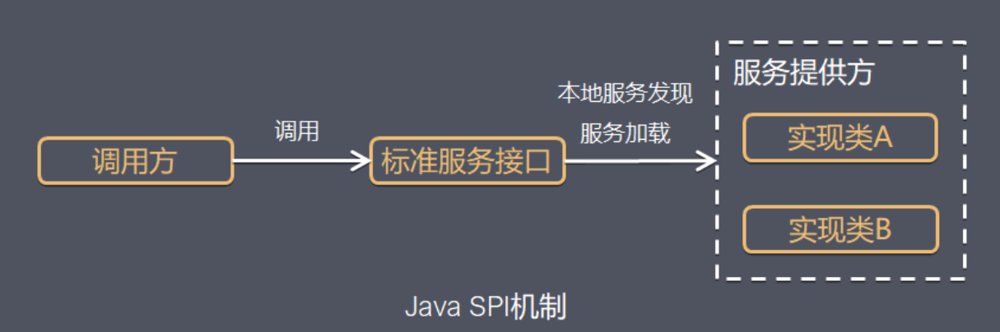

著作权归https://pdai.tech所有。 链接：https://www.pdai.tech/md/java/advanced/java-advanced-spi.html

## 什么是SPI机制

SPI（Service Provider Interface），是JDK内置的一种 服务提供发现机制，可以用来启用框架扩展和替换组件，主要是被框架的开发人员使用，比如java.sql.Driver接口，其他不同厂商可以针对同一接口做出不同的实现，MySQL和PostgreSQL都有不同的实现提供给用户，而Java的SPI机制可以为某个接口寻找服务实现。Java中SPI机制主要思想是将装配的控制权移到程序之外，在模块化设计中这个机制尤其重要，其核心思想就是 **解耦**。

SPI整体机制图如下：



当服务的提供者提供了一种接口的实现之后，需要在classpath下的`META-INF/services/`目录里创建一个以服务接口命名的文件，这个文件里的内容就是这个接口的具体的实现类。当其他的程序需要这个服务的时候，就可以通过查找这个jar包（一般都是以jar包做依赖）的`META-INF/services/`中的配置文件，配置文件中有接口的具体实现类名，可以根据这个类名进行加载实例化，就可以使用该服务了。JDK中查找服务的实现的工具类是：`java.util.ServiceLoader`。

## SPI实战演示

Spring 框架提供的日志服务 SLF4J 其实只是一个日志门面（接口），但是 SLF4J 的具体实现可以有几种，比如：Logback、Log4j、Log4j2 等等，而且还可以切换，在切换日志具体实现的时候我们是不需要更改项目代码的，只需要在 Maven 依赖里面修改一些 pom 依赖就好了。


这就是依赖 SPI 机制实现的，那我们接下来就实现一个简易版本的日志框架。

### [#](https://javaguide.cn/java/basis/spi.html#service-provider-interface)Service Provider Interface

新建一个 Java 项目 `service-provider-interface` 目录结构如下：（注意直接新建 Java 项目就好了，不用新建 Maven 项目，Maven 项目会涉及到一些编译配置，如果有私服的话，直接 deploy 会比较方便，但是没有的话，在过程中可能会遇到一些奇怪的问题。）


```text
│  service-provider-interface.iml
│
├─.idea
│  │  .gitignore
│  │  misc.xml
│  │  modules.xml
│  └─ workspace.xml
│
└─src
    └─edu
        └─jiangxuan
            └─up
                └─spi
                        Logger.java
                        LoggerService.java
                        Main.class
```

新建 `Logger` 接口，这个就是 SPI ， 服务提供者接口，后面的服务提供者就要针对这个接口进行实现。


```java
package edu.jiangxuan.up.spi;

public interface Logger {
    void info(String msg);
    void debug(String msg);
}
```

接下来就是 `LoggerService` 类，这个主要是为服务使用者（调用方）提供特定功能的。这个类也是实现 Java SPI 机制的关键所在，如果存在疑惑的话可以先往后面继续看。


```java
package edu.jiangxuan.up.spi;

import java.util.ArrayList;
import java.util.List;
import java.util.ServiceLoader;

public class LoggerService {
    private static final LoggerService SERVICE = new LoggerService();

    private final Logger logger;

    private final List<Logger> loggerList;

    private LoggerService() {
        ServiceLoader<Logger> loader = ServiceLoader.load(Logger.class);
        List<Logger> list = new ArrayList<>();
        for (Logger log : loader) {
            list.add(log);
        }
        // LoggerList 是所有 ServiceProvider
        loggerList = list;
        if (!list.isEmpty()) {
            // Logger 只取一个
            logger = list.get(0);
        } else {
            logger = null;
        }
    }

    public static LoggerService getService() {
        return SERVICE;
    }

    public void info(String msg) {
        if (logger == null) {
            System.out.println("info 中没有发现 Logger 服务提供者");
        } else {
            logger.info(msg);
        }
    }

    public void debug(String msg) {
        if (loggerList.isEmpty()) {
            System.out.println("debug 中没有发现 Logger 服务提供者");
        }
        loggerList.forEach(log -> log.debug(msg));
    }
}
```

新建 `Main` 类（服务使用者，调用方），启动程序查看结果。


```java
package org.spi.service;

public class Main {
    public static void main(String[] args) {
        LoggerService service = LoggerService.getService();

        service.info("Hello SPI");
        service.debug("Hello SPI");
    }
}
```

程序结果：

> info 中没有发现 Logger 服务提供者 debug 中没有发现 Logger 服务提供者

此时我们只是空有接口，并没有为 `Logger` 接口提供任何的实现，所以输出结果中没有按照预期打印相应的结果。

你可以使用命令或者直接使用 IDEA 将整个程序直接打包成 jar 包。

### [#](https://javaguide.cn/java/basis/spi.html#service-provider)Service Provider

接下来新建一个项目用来实现 `Logger` 接口

新建项目 `service-provider` 目录结构如下：


```text
│  service-provider.iml
│
├─.idea
│  │  .gitignore
│  │  misc.xml
│  │  modules.xml
│  └─ workspace.xml
│
├─lib
│      service-provider-interface.jar
|
└─src
    ├─edu
    │  └─jiangxuan
    │      └─up
    │          └─spi
    │              └─service
    │                      Logback.java
    │
    └─META-INF
        └─services
                edu.jiangxuan.up.spi.Logger
```


新建 `Logback` 类


```java
package edu.jiangxuan.up.spi.service;

import edu.jiangxuan.up.spi.Logger;

public class Logback implements Logger {
    @Override
    public void info(String s) {
        System.out.println("Logback info 打印日志：" + s);
    }

    @Override
    public void debug(String s) {
        System.out.println("Logback debug 打印日志：" + s);
    }
}
```


将 `service-provider-interface` 的 jar 导入项目中。

新建 lib 目录，然后将 jar 包拷贝过来，再添加到项目中。


再点击 OK 。


接下来就可以在项目中导入 jar 包里面的一些类和方法了，就像 JDK 工具类导包一样的。

实现 `Logger` 接口，在 `src` 目录下新建 `META-INF/services` 文件夹，然后新建文件 `edu.jiangxuan.up.spi.Logger` （SPI 的全类名），文件里面的内容是：`edu.jiangxuan.up.spi.service.Logback` （Logback 的全类名，即 SPI 的实现类的包名 + 类名）。

**这是 JDK SPI 机制 ServiceLoader 约定好的标准。**

这里先大概解释一下：Java 中的 SPI 机制就是在每次类加载的时候会先去找到 class 相对目录下的 `META-INF` 文件夹下的 services 文件夹下的文件，将这个文件夹下面的所有文件先加载到内存中，然后根据这些文件的文件名和里面的文件内容找到相应接口的具体实现类，找到实现类后就可以通过反射去生成对应的对象，保存在一个 list 列表里面，所以可以通过迭代或者遍历的方式拿到对应的实例对象，生成不同的实现。

所以会提出一些规范要求：文件名一定要是接口的全类名，然后里面的内容一定要是实现类的全类名，实现类可以有多个，直接换行就好了，多个实现类的时候，会一个一个的迭代加载。

接下来同样将 `service-provider` 项目打包成 jar 包，这个 jar 包就是服务提供方的实现。通常我们导入 maven 的 pom 依赖就有点类似这种，只不过我们现在没有将这个 jar 包发布到 maven 公共仓库中，所以在需要使用的地方只能手动的添加到项目中。

### [#](https://javaguide.cn/java/basis/spi.html#效果展示)效果展示

为了更直观的展示效果，我这里再新建一个专门用来测试的工程项目：`java-spi-test`

然后先导入 `Logger` 的接口 jar 包，再导入具体的实现类的 jar 包。


新建 Main 方法测试：


```java
package edu.jiangxuan.up.service;

import edu.jiangxuan.up.spi.LoggerService;

public class TestJavaSPI {
    public static void main(String[] args) {
        LoggerService loggerService = LoggerService.getService();
        loggerService.info("你好");
        loggerService.debug("测试Java SPI 机制");
    }
}
```

运行结果如下：

> Logback info 打印日志：你好 Logback debug 打印日志：测试 Java SPI 机制

说明导入 jar 包中的实现类生效了。

如果我们不导入具体的实现类的 jar 包，那么此时程序运行的结果就会是：

> info 中没有发现 Logger 服务提供者 debug 中没有发现 Logger 服务提供者

通过使用 SPI 机制，可以看出服务（`LoggerService`）和 服务提供者两者之间的耦合度非常低，如果说我们想要换一种实现，那么其实只需要修改 `service-provider` 项目中针对 `Logger` 接口的具体实现就可以了，只需要换一个 jar 包即可，也可以有在一个项目里面有多个实现，这不就是 SLF4J 原理吗？

如果某一天需求变更了，此时需要将日志输出到消息队列，或者做一些别的操作，这个时候完全不需要更改 Logback 的实现，只需要新增一个服务实现（service-provider）可以通过在本项目里面新增实现也可以从外部引入新的服务实现 jar 包。我们可以在服务(LoggerService)中选择一个具体的 服务实现(service-provider) 来完成我们需要的操作。

## [¶](#spi机制的广泛应用) SPI机制的广泛应用

### [¶](#spi机制---jdbc-drivermanager) SPI机制 - JDBC DriverManager

> 在JDBC4.0之前，我们开发有连接数据库的时候，通常会用Class.forName("com.mysql.jdbc.Driver")这句先加载数据库相关的驱动，然后再进行获取连接等的操作。**而JDBC4.0之后不需要用Class.forName("com.mysql.jdbc.Driver")来加载驱动，直接获取连接就可以了，现在这种方式就是使用了Java的SPI扩展机制来实现**。

#### [¶](#jdbc接口定义) JDBC接口定义

首先在java中定义了接口`java.sql.Driver`，并没有具体的实现，具体的实现都是由不同厂商来提供的。

#### [¶](#mysql实现) mysql实现

在mysql的jar包`mysql-connector-java-6.0.6.jar`中，可以找到`META-INF/services`目录，该目录下会有一个名字为`java.sql.Driver`的文件，文件内容是`com.mysql.cj.jdbc.Driver`，这里面的内容就是针对Java中定义的接口的实现。

#### [¶](#postgresql实现) postgresql实现

同样在postgresql的jar包`postgresql-42.0.0.jar`中，也可以找到同样的配置文件，文件内容是`org.postgresql.Driver`，这是postgresql对Java的`java.sql.Driver`的实现。

#### [¶](#使用方法) 使用方法

上面说了，现在使用SPI扩展来加载具体的驱动，我们在Java中写连接数据库的代码的时候，不需要再使用`Class.forName("com.mysql.jdbc.Driver")`来加载驱动了，而是直接使用如下代码：

```java
String url = "jdbc:xxxx://xxxx:xxxx/xxxx";
Connection conn = DriverManager.getConnection(url,username,password);
.....
  
        @pdai: 代码已经复制到剪贴板
    
```

这里并没有涉及到spi的使用，接着看下面的解析。

#### [¶](#源码实现) 源码实现

上面的使用方法，就是我们普通的连接数据库的代码，并没有涉及到SPI的东西，但是有一点我们可以确定的是，我们没有写有关具体驱动的硬编码`Class.forName("com.mysql.jdbc.Driver")`！

上面的代码可以直接获取数据库连接进行操作，但是跟SPI有啥关系呢？上面代码没有了加载驱动的代码，我们怎么去确定使用哪个数据库连接的驱动呢？这里就涉及到使用Java的SPI扩展机制来查找相关驱动的东西了，关于驱动的查找其实都在`DriverManager`中，`DriverManager`是Java中的实现，用来获取数据库连接，在`DriverManager`中有一个静态代码块如下：

```java
static {
    loadInitialDrivers();
    println("JDBC DriverManager initialized");
}
  
        @pdai: 代码已经复制到剪贴板
    
```

可以看到是加载实例化驱动的，接着看loadInitialDrivers方法：

```java
private static void loadInitialDrivers() {
    String drivers;
    try {
        drivers = AccessController.doPrivileged(new PrivilegedAction<String>() {
            public String run() {
                return System.getProperty("jdbc.drivers");
            }
        });
    } catch (Exception ex) {
        drivers = null;
    }

    AccessController.doPrivileged(new PrivilegedAction<Void>() {
        public Void run() {
			//使用SPI的ServiceLoader来加载接口的实现
            ServiceLoader<Driver> loadedDrivers = ServiceLoader.load(Driver.class);
            Iterator<Driver> driversIterator = loadedDrivers.iterator();
            try{
                while(driversIterator.hasNext()) {
                    driversIterator.next();
                }
            } catch(Throwable t) {
            // Do nothing
            }
            return null;
        }
    });

    println("DriverManager.initialize: jdbc.drivers = " + drivers);

    if (drivers == null || drivers.equals("")) {
        return;
    }
    String[] driversList = drivers.split(":");
    println("number of Drivers:" + driversList.length);
    for (String aDriver : driversList) {
        try {
            println("DriverManager.Initialize: loading " + aDriver);
            Class.forName(aDriver, true,
                    ClassLoader.getSystemClassLoader());
        } catch (Exception ex) {
            println("DriverManager.Initialize: load failed: " + ex);
        }
    }
}
  
        @pdai: 代码已经复制到剪贴板
    
```


上面的代码主要步骤是：

- 从系统变量中获取有关驱动的定义。
- 使用SPI来获取驱动的实现。
- 遍历使用SPI获取到的具体实现，实例化各个实现类。
- 根据第一步获取到的驱动列表来实例化具体实现类。

我们主要关注2,3步，这两步是SPI的用法，首先看第二步，使用SPI来获取驱动的实现，对应的代码是：

```java
ServiceLoader<Driver> loadedDrivers = ServiceLoader.load(Driver.class);
  
        @pdai: 代码已经复制到剪贴板
    
```

1

这里没有去`META-INF/services`目录下查找配置文件，也没有加载具体实现类，做的事情就是封装了我们的接口类型和类加载器，并初始化了一个迭代器。

接着看第三步，遍历使用SPI获取到的具体实现，实例化各个实现类，对应的代码如下：

```java
//获取迭代器
Iterator<Driver> driversIterator = loadedDrivers.iterator();
//遍历所有的驱动实现
while(driversIterator.hasNext()) {
    driversIterator.next();
}
  
        @pdai: 代码已经复制到剪贴板
    
```


在遍历的时候，首先调用`driversIterator.hasNext()`方法，这里会搜索classpath下以及jar包中所有的`META-INF/services`目录下的`java.sql.Driver`文件，并找到文件中的实现类的名字，此时并没有实例化具体的实现类（ServiceLoader具体的源码实现在下面）。

然后是调用`driversIterator.next();`方法，此时就会根据驱动名字具体实例化各个实现类了。现在驱动就被找到并实例化了。

可以看下截图，我在测试项目中添加了两个jar包，`mysql-connector-java-6.0.6.jar`和`postgresql-42.0.0.0.jar`，跟踪到DriverManager中之后：


可以看到此时迭代器中有两个驱动，mysql和postgresql的都被加载了。

### [¶](#spi机制---common-logging) SPI机制 - Common-Logging

> common-logging（也称Jakarta Commons Logging，缩写 JCL）是常用的日志库门面，具体[日志库相关可以看这篇]()。我们看下它是怎么解耦的。

首先，日志实例是通过LogFactory的getLog(String)方法创建的：

```java
public static getLog(Class clazz) throws LogConfigurationException {
    return getFactory().getInstance(clazz);
}
  
        @pdai: 代码已经复制到剪贴板
    
```


LogFatory是一个抽象类，它负责加载具体的日志实现，分析其Factory getFactory()方法：

```java
public static org.apache.commons.logging.LogFactory getFactory() throws LogConfigurationException {
    // Identify the class loader we will be using
    ClassLoader contextClassLoader = getContextClassLoaderInternal();

    if (contextClassLoader == null) {
        // This is an odd enough situation to report about. This
        // output will be a nuisance on JDK1.1, as the system
        // classloader is null in that environment.
        if (isDiagnosticsEnabled()) {
            logDiagnostic("Context classloader is null.");
        }
    }

    // Return any previously registered factory for this class loader
    org.apache.commons.logging.LogFactory factory = getCachedFactory(contextClassLoader);
    if (factory != null) {
        return factory;
    }

    if (isDiagnosticsEnabled()) {
        logDiagnostic(
                "[LOOKUP] LogFactory implementation requested for the first time for context classloader " +
                        objectId(contextClassLoader));
        logHierarchy("[LOOKUP] ", contextClassLoader);
    }

    // Load properties file.
    //
    // If the properties file exists, then its contents are used as
    // "attributes" on the LogFactory implementation class. One particular
    // property may also control which LogFactory concrete subclass is
    // used, but only if other discovery mechanisms fail..
    //
    // As the properties file (if it exists) will be used one way or
    // another in the end we may as well look for it first.
    // classpath根目录下寻找commons-logging.properties
    Properties props = getConfigurationFile(contextClassLoader, FACTORY_PROPERTIES);

    // Determine whether we will be using the thread context class loader to
    // load logging classes or not by checking the loaded properties file (if any).
    // classpath根目录下commons-logging.properties是否配置use_tccl
    ClassLoader baseClassLoader = contextClassLoader;
    if (props != null) {
        String useTCCLStr = props.getProperty(TCCL_KEY);
        if (useTCCLStr != null) {
            // The Boolean.valueOf(useTCCLStr).booleanValue() formulation
            // is required for Java 1.2 compatibility.
            if (Boolean.valueOf(useTCCLStr).booleanValue() == false) {
                // Don't use current context classloader when locating any
                // LogFactory or Log classes, just use the class that loaded
                // this abstract class. When this class is deployed in a shared
                // classpath of a container, it means webapps cannot deploy their
                // own logging implementations. It also means that it is up to the
                // implementation whether to load library-specific config files
                // from the TCCL or not.
                baseClassLoader = thisClassLoader;
            }
        }
    }

    // 这里真正开始决定使用哪个factory
    // 首先，尝试查找vm系统属性org.apache.commons.logging.LogFactory，其是否指定factory
    // Determine which concrete LogFactory subclass to use.
    // First, try a global system property
    if (isDiagnosticsEnabled()) {
        logDiagnostic("[LOOKUP] Looking for system property [" + FACTORY_PROPERTY +
                "] to define the LogFactory subclass to use...");
    }

    try {
        String factoryClass = getSystemProperty(FACTORY_PROPERTY, null);
        if (factoryClass != null) {
            if (isDiagnosticsEnabled()) {
                logDiagnostic("[LOOKUP] Creating an instance of LogFactory class '" + factoryClass +
                        "' as specified by system property " + FACTORY_PROPERTY);
            }
            factory = newFactory(factoryClass, baseClassLoader, contextClassLoader);
        } else {
            if (isDiagnosticsEnabled()) {
                logDiagnostic("[LOOKUP] No system property [" + FACTORY_PROPERTY + "] defined.");
            }
        }
    } catch (SecurityException e) {
        if (isDiagnosticsEnabled()) {
            logDiagnostic("[LOOKUP] A security exception occurred while trying to create an" +
                    " instance of the custom factory class" + ": [" + trim(e.getMessage()) +
                    "]. Trying alternative implementations...");
        }
        // ignore
    } catch (RuntimeException e) {
        // This is not consistent with the behaviour when a bad LogFactory class is
        // specified in a services file.
        //
        // One possible exception that can occur here is a ClassCastException when
        // the specified class wasn't castable to this LogFactory type.
        if (isDiagnosticsEnabled()) {
            logDiagnostic("[LOOKUP] An exception occurred while trying to create an" +
                    " instance of the custom factory class" + ": [" +
                    trim(e.getMessage()) +
                    "] as specified by a system property.");
        }
        throw e;
    }

    // 第二，尝试使用java spi服务发现机制，载META-INF/services下寻找org.apache.commons.logging.LogFactory实现
    // Second, try to find a service by using the JDK1.3 class
    // discovery mechanism, which involves putting a file with the name
    // of an interface class in the META-INF/services directory, where the
    // contents of the file is a single line specifying a concrete class
    // that implements the desired interface.

    if (factory == null) {
        if (isDiagnosticsEnabled()) {
            logDiagnostic("[LOOKUP] Looking for a resource file of name [" + SERVICE_ID +
                    "] to define the LogFactory subclass to use...");
        }
        try {
            // META-INF/services/org.apache.commons.logging.LogFactory, SERVICE_ID
            final InputStream is = getResourceAsStream(contextClassLoader, SERVICE_ID);

            if (is != null) {
                // This code is needed by EBCDIC and other strange systems.
                // It's a fix for bugs reported in xerces
                BufferedReader rd;
                try {
                    rd = new BufferedReader(new InputStreamReader(is, "UTF-8"));
                } catch (java.io.UnsupportedEncodingException e) {
                    rd = new BufferedReader(new InputStreamReader(is));
                }

                String factoryClassName = rd.readLine();
                rd.close();

                if (factoryClassName != null && !"".equals(factoryClassName)) {
                    if (isDiagnosticsEnabled()) {
                        logDiagnostic("[LOOKUP]  Creating an instance of LogFactory class " +
                                factoryClassName +
                                " as specified by file '" + SERVICE_ID +
                                "' which was present in the path of the context classloader.");
                    }
                    factory = newFactory(factoryClassName, baseClassLoader, contextClassLoader);
                }
            } else {
                // is == null
                if (isDiagnosticsEnabled()) {
                    logDiagnostic("[LOOKUP] No resource file with name '" + SERVICE_ID + "' found.");
                }
            }
        } catch (Exception ex) {
            // note: if the specified LogFactory class wasn't compatible with LogFactory
            // for some reason, a ClassCastException will be caught here, and attempts will
            // continue to find a compatible class.
            if (isDiagnosticsEnabled()) {
                logDiagnostic(
                        "[LOOKUP] A security exception occurred while trying to create an" +
                                " instance of the custom factory class" +
                                ": [" + trim(ex.getMessage()) +
                                "]. Trying alternative implementations...");
            }
            // ignore
        }
    }

    // 第三，尝试从classpath根目录下的commons-logging.properties中查找org.apache.commons.logging.LogFactory属性指定的factory
    // Third try looking into the properties file read earlier (if found)

    if (factory == null) {
        if (props != null) {
            if (isDiagnosticsEnabled()) {
                logDiagnostic(
                        "[LOOKUP] Looking in properties file for entry with key '" + FACTORY_PROPERTY +
                                "' to define the LogFactory subclass to use...");
            }
            String factoryClass = props.getProperty(FACTORY_PROPERTY);
            if (factoryClass != null) {
                if (isDiagnosticsEnabled()) {
                    logDiagnostic(
                            "[LOOKUP] Properties file specifies LogFactory subclass '" + factoryClass + "'");
                }
                factory = newFactory(factoryClass, baseClassLoader, contextClassLoader);

                // TODO: think about whether we need to handle exceptions from newFactory
            } else {
                if (isDiagnosticsEnabled()) {
                    logDiagnostic("[LOOKUP] Properties file has no entry specifying LogFactory subclass.");
                }
            }
        } else {
            if (isDiagnosticsEnabled()) {
                logDiagnostic("[LOOKUP] No properties file available to determine" + " LogFactory subclass from..");
            }
        }
    }

    // 最后，使用后备factory实现，org.apache.commons.logging.impl.LogFactoryImpl
    // Fourth, try the fallback implementation class

    if (factory == null) {
        if (isDiagnosticsEnabled()) {
            logDiagnostic(
                    "[LOOKUP] Loading the default LogFactory implementation '" + FACTORY_DEFAULT +
                            "' via the same classloader that loaded this LogFactory" +
                            " class (ie not looking in the context classloader).");
        }

        // Note: unlike the above code which can try to load custom LogFactory
        // implementations via the TCCL, we don't try to load the default LogFactory
        // implementation via the context classloader because:
        // * that can cause problems (see comments in newFactory method)
        // * no-one should be customising the code of the default class
        // Yes, we do give up the ability for the child to ship a newer
        // version of the LogFactoryImpl class and have it used dynamically
        // by an old LogFactory class in the parent, but that isn't
        // necessarily a good idea anyway.
        factory = newFactory(FACTORY_DEFAULT, thisClassLoader, contextClassLoader);
    }

    if (factory != null) {
        /**
            * Always cache using context class loader.
            */
        cacheFactory(contextClassLoader, factory);

        if (props != null) {
            Enumeration names = props.propertyNames();
            while (names.hasMoreElements()) {
                String name = (String) names.nextElement();
                String value = props.getProperty(name);
                factory.setAttribute(name, value);
            }
        }
    }

    return factory;
}
  
        @pdai: 代码已经复制到剪贴板
    
```


可以看出，抽象类LogFactory加载具体实现的步骤如下：

- 从vm系统属性org.apache.commons.logging.LogFactory
- 使用SPI服务发现机制，发现org.apache.commons.logging.LogFactory的实现
- 查找classpath根目录commons-logging.properties的org.apache.commons.logging.LogFactory属性是否指定factory实现
- 使用默认factory实现，org.apache.commons.logging.impl.LogFactoryImpl

> LogFactory的getLog()方法返回类型是org.apache.commons.logging.Log接口，提供了从trace到fatal方法。可以确定，如果日志实现提供者只要实现该接口，并且使用继承自org.apache.commons.logging.LogFactory的子类创建Log，必然可以构建一个松耦合的日志系统。

### [¶](#spi机制---插件体系) SPI机制 - 插件体系

> 其实最具spi思想的应该属于插件开发，我们项目中也用到的这种思想，后面再说，这里具体说一下eclipse的插件思想。

Eclipse使用OSGi作为插件系统的基础，动态添加新插件和停止现有插件，以动态的方式管理组件生命周期。

一般来说，插件的文件结构必须在指定目录下包含以下三个文件：

- `META-INF/MANIFEST.MF`: 项目基本配置信息，版本、名称、启动器等
- `build.properties`: 项目的编译配置信息，包括，源代码路径、输出路径
- `plugin.xml`：插件的操作配置信息，包含弹出菜单及点击菜单后对应的操作执行类等

当eclipse启动时，会遍历plugins文件夹中的目录，扫描每个插件的清单文件`MANIFEST.MF`，并建立一个内部模型来记录它所找到的每个插件的信息，就实现了动态添加新的插件。

这也意味着是eclipse制定了一系列的规则，像是文件结构、类型、参数等。插件开发者遵循这些规则去开发自己的插件，eclipse并不需要知道插件具体是怎样开发的，只需要在启动的时候根据配置文件解析、加载到系统里就好了，是spi思想的一种体现。

### [¶](#spi机制---spring中spi机制) SPI机制 - Spring中SPI机制

在springboot的自动装配过程中，最终会加载`META-INF/spring.factories`文件，而加载的过程是由`SpringFactoriesLoader`加载的。从CLASSPATH下的每个Jar包中搜寻所有`META-INF/spring.factories`配置文件，然后将解析properties文件，找到指定名称的配置后返回。需要注意的是，其实这里不仅仅是会去ClassPath路径下查找，会扫描所有路径下的Jar包，只不过这个文件只会在Classpath下的jar包中。

```java
public static final String FACTORIES_RESOURCE_LOCATION = "META-INF/spring.factories";
// spring.factories文件的格式为：key=value1,value2,value3
// 从所有的jar包中找到META-INF/spring.factories文件
// 然后从文件中解析出key=factoryClass类名称的所有value值
public static List<String> loadFactoryNames(Class<?> factoryClass, ClassLoader classLoader) {
    String factoryClassName = factoryClass.getName();
    // 取得资源文件的URL
    Enumeration<URL> urls = (classLoader != null ? classLoader.getResources(FACTORIES_RESOURCE_LOCATION) : ClassLoader.getSystemResources(FACTORIES_RESOURCE_LOCATION));
    List<String> result = new ArrayList<String>();
    // 遍历所有的URL
    while (urls.hasMoreElements()) {
        URL url = urls.nextElement();
        // 根据资源文件URL解析properties文件，得到对应的一组@Configuration类
        Properties properties = PropertiesLoaderUtils.loadProperties(new UrlResource(url));
        String factoryClassNames = properties.getProperty(factoryClassName);
        // 组装数据，并返回
        result.addAll(Arrays.asList(StringUtils.commaDelimitedListToStringArray(factoryClassNames)));
    }
    return result;
}
  
        @pdai: 代码已经复制到剪贴板
    
```

## [¶](#spi机制深入理解) SPI机制深入理解

TIP

接下来，我们深入理解下SPI相关内容

### [¶](#spi机制通常怎么使用) SPI机制通常怎么使用

看完上面的几个例子解析，应该都能知道大概的流程了：

- 有关组织或者公司定义标准。
- 具体厂商或者框架开发者实现。
- 程序猿使用。

#### [¶](#定义标准) 定义标准

定义标准，就是定义接口。比如接口`java.sql.Driver`

#### [¶](#具体厂商或者框架开发者实现) 具体厂商或者框架开发者实现

厂商或者框架开发者开发具体的实现：

在`META-INF/services`目录下定义一个名字为接口全限定名的文件，比如`java.sql.Driver`文件，文件内容是具体的实现名字，比如`me.cxis.sql.MyDriver`。

写具体的实现`me.cxis.sql.MyDriver`，都是对接口Driver的实现。

#### [¶](#程序猿使用) 程序猿使用

我们会引用具体厂商的jar包来实现我们的功能：

```java
ServiceLoader<Driver> loadedDrivers = ServiceLoader.load(Driver.class);
//获取迭代器
Iterator<Driver> driversIterator = loadedDrivers.iterator();
//遍历
while(driversIterator.hasNext()) {
    driversIterator.next();
    //可以做具体的业务逻辑
}
  
        @pdai: 代码已经复制到剪贴板
    
```


#### [¶](#使用规范) 使用规范

最后总结一下jdk spi需要遵循的规范


### [¶](#spi和api的区别是什么) SPI和API的区别是什么

> 这里实际包含两个问题，第一个SPI和API的区别？第二个什么时候用API，什么时候用SPI？

> SPI - “接口”位于“调用方”所在的“包”中

- 概念上更依赖调用方。
- 组织上位于调用方所在的包中。
- 实现位于独立的包中。
- 常见的例子是：插件模式的插件。

> API - “接口”位于“实现方”所在的“包”中

- 概念上更接近实现方。
- 组织上位于实现方所在的包中。
- 实现和接口在一个包中。

参考：

- [difference-between-spi-and-api  (opens new window)](https://stackoverflow.com/questions/2954372/difference-between-spi-and-api?answertab=votes#tab-top)
- [设计原则：小议 SPI 和 API  (opens new window)](https://www.cnblogs.com/happyframework/archive/2013/09/17/3325560.html)


### [¶](#spi机制实现原理) SPI机制实现原理

不妨看下JDK中`ServiceLoader<S>`方法的具体实现：

```java
//ServiceLoader实现了Iterable接口，可以遍历所有的服务实现者
public final class ServiceLoader<S>
    implements Iterable<S>
{

    //查找配置文件的目录
    private static final String PREFIX = "META-INF/services/";

    //表示要被加载的服务的类或接口
    private final Class<S> service;

    //这个ClassLoader用来定位，加载，实例化服务提供者
    private final ClassLoader loader;

    // 访问控制上下文
    private final AccessControlContext acc;

    // 缓存已经被实例化的服务提供者，按照实例化的顺序存储
    private LinkedHashMap<String,S> providers = new LinkedHashMap<>();

    // 迭代器
    private LazyIterator lookupIterator;


    //重新加载，就相当于重新创建ServiceLoader了，用于新的服务提供者安装到正在运行的Java虚拟机中的情况。
    public void reload() {
        //清空缓存中所有已实例化的服务提供者
        providers.clear();
        //新建一个迭代器，该迭代器会从头查找和实例化服务提供者
        lookupIterator = new LazyIterator(service, loader);
    }

    //私有构造器
    //使用指定的类加载器和服务创建服务加载器
    //如果没有指定类加载器，使用系统类加载器，就是应用类加载器。
    private ServiceLoader(Class<S> svc, ClassLoader cl) {
        service = Objects.requireNonNull(svc, "Service interface cannot be null");
        loader = (cl == null) ? ClassLoader.getSystemClassLoader() : cl;
        acc = (System.getSecurityManager() != null) ? AccessController.getContext() : null;
        reload();
    }

    //解析失败处理的方法
    private static void fail(Class<?> service, String msg, Throwable cause)
        throws ServiceConfigurationError
    {
        throw new ServiceConfigurationError(service.getName() + ": " + msg,
                                            cause);
    }

    private static void fail(Class<?> service, String msg)
        throws ServiceConfigurationError
    {
        throw new ServiceConfigurationError(service.getName() + ": " + msg);
    }

    private static void fail(Class<?> service, URL u, int line, String msg)
        throws ServiceConfigurationError
    {
        fail(service, u + ":" + line + ": " + msg);
    }

    //解析服务提供者配置文件中的一行
    //首先去掉注释校验，然后保存
    //返回下一行行号
    //重复的配置项和已经被实例化的配置项不会被保存
    private int parseLine(Class<?> service, URL u, BufferedReader r, int lc,
                          List<String> names)
        throws IOException, ServiceConfigurationError
    {
        //读取一行
        String ln = r.readLine();
        if (ln == null) {
            return -1;
        }
        //#号代表注释行
        int ci = ln.indexOf('#');
        if (ci >= 0) ln = ln.substring(0, ci);
        ln = ln.trim();
        int n = ln.length();
        if (n != 0) {
            if ((ln.indexOf(' ') >= 0) || (ln.indexOf('\t') >= 0))
                fail(service, u, lc, "Illegal configuration-file syntax");
            int cp = ln.codePointAt(0);
            if (!Character.isJavaIdentifierStart(cp))
                fail(service, u, lc, "Illegal provider-class name: " + ln);
            for (int i = Character.charCount(cp); i < n; i += Character.charCount(cp)) {
                cp = ln.codePointAt(i);
                if (!Character.isJavaIdentifierPart(cp) && (cp != '.'))
                    fail(service, u, lc, "Illegal provider-class name: " + ln);
            }
            if (!providers.containsKey(ln) && !names.contains(ln))
                names.add(ln);
        }
        return lc + 1;
    }

    //解析配置文件，解析指定的url配置文件
    //使用parseLine方法进行解析，未被实例化的服务提供者会被保存到缓存中去
    private Iterator<String> parse(Class<?> service, URL u)
        throws ServiceConfigurationError
    {
        InputStream in = null;
        BufferedReader r = null;
        ArrayList<String> names = new ArrayList<>();
        try {
            in = u.openStream();
            r = new BufferedReader(new InputStreamReader(in, "utf-8"));
            int lc = 1;
            while ((lc = parseLine(service, u, r, lc, names)) >= 0);
        }
        return names.iterator();
    }

    //服务提供者查找的迭代器
    private class LazyIterator
        implements Iterator<S>
    {

        Class<S> service;//服务提供者接口
        ClassLoader loader;//类加载器
        Enumeration<URL> configs = null;//保存实现类的url
        Iterator<String> pending = null;//保存实现类的全名
        String nextName = null;//迭代器中下一个实现类的全名

        private LazyIterator(Class<S> service, ClassLoader loader) {
            this.service = service;
            this.loader = loader;
        }

        private boolean hasNextService() {
            if (nextName != null) {
                return true;
            }
            if (configs == null) {
                try {
                    String fullName = PREFIX + service.getName();
                    if (loader == null)
                        configs = ClassLoader.getSystemResources(fullName);
                    else
                        configs = loader.getResources(fullName);
                }
            }
            while ((pending == null) || !pending.hasNext()) {
                if (!configs.hasMoreElements()) {
                    return false;
                }
                pending = parse(service, configs.nextElement());
            }
            nextName = pending.next();
            return true;
        }

        private S nextService() {
            if (!hasNextService())
                throw new NoSuchElementException();
            String cn = nextName;
            nextName = null;
            Class<?> c = null;
            try {
                c = Class.forName(cn, false, loader);
            }
            if (!service.isAssignableFrom(c)) {
                fail(service, "Provider " + cn  + " not a subtype");
            }
            try {
                S p = service.cast(c.newInstance());
                providers.put(cn, p);
                return p;
            }
        }

        public boolean hasNext() {
            if (acc == null) {
                return hasNextService();
            } else {
                PrivilegedAction<Boolean> action = new PrivilegedAction<Boolean>() {
                    public Boolean run() { return hasNextService(); }
                };
                return AccessController.doPrivileged(action, acc);
            }
        }

        public S next() {
            if (acc == null) {
                return nextService();
            } else {
                PrivilegedAction<S> action = new PrivilegedAction<S>() {
                    public S run() { return nextService(); }
                };
                return AccessController.doPrivileged(action, acc);
            }
        }

        public void remove() {
            throw new UnsupportedOperationException();
        }

    }

    //获取迭代器
    //返回遍历服务提供者的迭代器
    //以懒加载的方式加载可用的服务提供者
    //懒加载的实现是：解析配置文件和实例化服务提供者的工作由迭代器本身完成
    public Iterator<S> iterator() {
        return new Iterator<S>() {
            //按照实例化顺序返回已经缓存的服务提供者实例
            Iterator<Map.Entry<String,S>> knownProviders
                = providers.entrySet().iterator();

            public boolean hasNext() {
                if (knownProviders.hasNext())
                    return true;
                return lookupIterator.hasNext();
            }

            public S next() {
                if (knownProviders.hasNext())
                    return knownProviders.next().getValue();
                return lookupIterator.next();
            }

            public void remove() {
                throw new UnsupportedOperationException();
            }

        };
    }

    //为指定的服务使用指定的类加载器来创建一个ServiceLoader
    public static <S> ServiceLoader<S> load(Class<S> service,
                                            ClassLoader loader)
    {
        return new ServiceLoader<>(service, loader);
    }

    //使用线程上下文的类加载器来创建ServiceLoader
    public static <S> ServiceLoader<S> load(Class<S> service) {
        ClassLoader cl = Thread.currentThread().getContextClassLoader();
        return ServiceLoader.load(service, cl);
    }

    //使用扩展类加载器为指定的服务创建ServiceLoader
    //只能找到并加载已经安装到当前Java虚拟机中的服务提供者，应用程序类路径中的服务提供者将被忽略
    public static <S> ServiceLoader<S> loadInstalled(Class<S> service) {
        ClassLoader cl = ClassLoader.getSystemClassLoader();
        ClassLoader prev = null;
        while (cl != null) {
            prev = cl;
            cl = cl.getParent();
        }
        return ServiceLoader.load(service, prev);
    }

    public String toString() {
        return "java.util.ServiceLoader[" + service.getName() + "]";
    }

}
  
        @pdai: 代码已经复制到剪贴板
    
```

**首先**，ServiceLoader实现了`Iterable`接口，所以它有迭代器的属性，这里主要都是实现了迭代器的`hasNext`和`next`方法。这里主要都是调用的`lookupIterator`的相应`hasNext`和`next`方法，`lookupIterator`是懒加载迭代器。

**其次**，`LazyIterator`中的`hasNext`方法，静态变量PREFIX就是`”META-INF/services/”`目录，这也就是为什么需要在`classpath`下的`META-INF/services/`目录里创建一个以服务接口命名的文件。

**最后**，通过反射方法`Class.forName()`加载类对象，并用`newInstance`方法将类实例化，并把实例化后的类缓存到`providers`对象中，(`LinkedHashMap<String,S>`类型）然后返回实例对象。

所以我们可以看到`ServiceLoader`不是实例化以后，就去读取配置文件中的具体实现，并进行实例化。而是等到使用迭代器去遍历的时候，才会加载对应的配置文件去解析，调用`hasNext`方法的时候会去加载配置文件进行解析，调用`next`方法的时候进行实例化并缓存。

所有的配置文件只会加载一次，服务提供者也只会被实例化一次，重新加载配置文件可使用`reload`方法。

### 自己实现一个 ServiceLoader

关键信息基本已经通过代码注释描述出来了，

主要的流程就是：

1. 通过 URL 工具类从 jar 包的 `/META-INF/services` 目录下面找到对应的文件，
2. 读取这个文件的名称找到对应的 spi 接口，
3. 通过 `InputStream` 流将文件里面的具体实现类的全类名读取出来，
4. 根据获取到的全类名，先判断跟 spi 接口是否为同一类型，如果是的，那么就通过反射的机制构造对应的实例对象，
5. 将构造出来的实例对象添加到 `Providers` 的列表中。

```java
package edu.jiangxuan.up.service;

import java.io.BufferedReader;
import java.io.InputStream;
import java.io.InputStreamReader;
import java.lang.reflect.Constructor;
import java.net.URL;
import java.net.URLConnection;
import java.util.ArrayList;
import java.util.Enumeration;
import java.util.List;

public class MyServiceLoader<S> {
// 对应的接口 Class 模板
private final Class<S> service;

// 对应实现类的 可以有多个，用 List 进行封装
private final List<S> providers = new ArrayList<>();

// 类加载器
private final ClassLoader classLoader;

// 暴露给外部使用的方法，通过调用这个方法可以开始加载自己定制的实现流程。
public static <S> MyServiceLoader<S> load(Class<S> service) {
    return new MyServiceLoader<>(service);
}

// 构造方法私有化
private MyServiceLoader(Class<S> service) {
    this.service = service;
    this.classLoader = Thread.currentThread().getContextClassLoader();
    doLoad();
}

// 关键方法，加载具体实现类的逻辑
private void doLoad() {
    try {
        // 读取所有 jar 包里面 META-INF/services 包下面的文件，这个文件名就是接口名，然后文件里面的内容就是具体的实现类的路径加全类名
        Enumeration<URL> urls = classLoader.getResources("META-INF/services/" + service.getName());
        // 挨个遍历取到的文件
        while (urls.hasMoreElements()) {
            // 取出当前的文件
            URL url = urls.nextElement();
            System.out.println("File = " + url.getPath());
            // 建立链接
            URLConnection urlConnection = url.openConnection();
            urlConnection.setUseCaches(false);
            // 获取文件输入流
            InputStream inputStream = urlConnection.getInputStream();
            // 从文件输入流获取缓存
            BufferedReader bufferedReader = new BufferedReader(new InputStreamReader(inputStream));
            // 从文件内容里面得到实现类的全类名
            String className = bufferedReader.readLine();

            while (className != null) {
                // 通过反射拿到实现类的实例
                Class<?> clazz = Class.forName(className, false, classLoader);
                // 如果声明的接口跟这个具体的实现类是属于同一类型，（可以理解为Java的一种多态，接口跟实现类、父类和子类等等这种关系。）则构造实例
                if (service.isAssignableFrom(clazz)) {
                    Constructor<? extends S> constructor = (Constructor<? extends S>) clazz.getConstructor();
                    S instance = constructor.newInstance();
                    // 把当前构造的实例对象添加到 Provider的列表里面
                    providers.add(instance);
                }
                // 继续读取下一行的实现类，可以有多个实现类，只需要换行就可以了。
                className = bufferedReader.readLine();
            }
        }
    } catch (Exception e) {
        System.out.println("读取文件异常。。。");
    }
}

// 返回spi接口对应的具体实现类列表
public List<S> getProviders() {
    return providers;
}
}
```


### [¶](#spi机制的缺陷) SPI机制的缺陷

通过上面的解析，可以发现，我们使用SPI机制的缺陷：

- 不能按需加载，需要遍历所有的实现，并实例化，然后在循环中才能找到我们需要的实现。如果不想用某些实现类，或者某些类实例化很耗时，它也被载入并实例化了，这就造成了浪费。
- 获取某个实现类的方式不够灵活，只能通过 Iterator 形式获取，不能根据某个参数来获取对应的实现类。
- 多个并发多线程使用 ServiceLoader 类的实例是不安全的。

## [¶](#参考文章) 参考文章

- https://cxis.me/2017/04/17/Java%E4%B8%ADSPI%E6%9C%BA%E5%88%B6%E6%B7%B1%E5%85%A5%E5%8F%8A%E6%BA%90%E7%A0%81%E8%A7%A3%E6%9E%90/
- https://stackoverflow.com/questions/2954372/difference-between-spi-and-api?answertab=votes#tab-top
- https://zhuanlan.zhihu.com/p/28909673
- http://blog.itpub.net/69912579/viewspace-2656555/
- https://www.cnblogs.com/happyframework/archive/2013/09/17/3325560.html
- https://blog.csdn.net/sakurainluojia/article/details/53534949
- https://www.jianshu.com/p/0d196ad23915