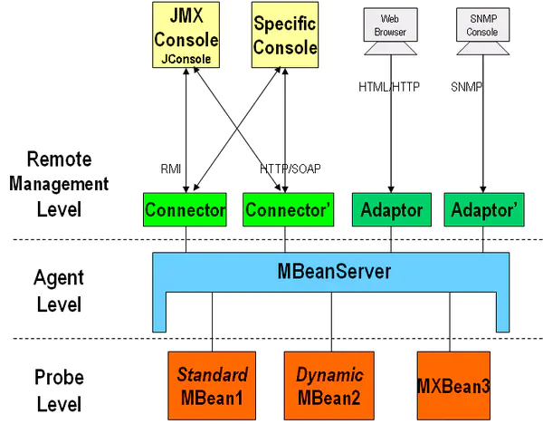

# 什么是JMX？

所谓JMX，是Java Management Extensions(Java管理扩展)的缩写，是一个为应用程序植入管理功能的框架。用户可以在任何Java应用程序中使用这些代理和服务实现管理。

### 一、JMX架构图




从图中我们可以看到，JMX的结构一共分为三层：

##### 1、 基础层：主要是Mbean，被管理的java bean

Mbean分为如下四中

| 类型           | 描述                                                         |
| -------------- | ------------------------------------------------------------ |
| standard MBean | 这种类型的MBean最简单，**它能管理的资源（包括属性，方法，时间）必须定义在接口中，然后MBean必须实现这个接口**。**它的命名也必须遵循一定的规范，例如我们的MBean为Hello，则接口必须为HelloMBean**。 |
| dynamic MBean  | 必须实现javax.management.DynamicMBean接口，所有的属性，方法都在运行时定义 |
| model MBean    | 与标准和动态MBean相比，你可以不用写MBean类，只需使用javax.management.modelmbean.RequiredModelMBean即可。RequiredModelMBean实现了ModelMBean接口，而ModelMBean扩展了DynamicMBean接口，因此与DynamicMBean相似，Model MBean的管理资源也是在运行时定义的。与DynamicMBean不同的是，DynamicMBean管理的资源一般定义在DynamicMBean中（运行时才决定管理那些资源），而model MBean管理的资源并不在MBean中，而是在外部（通常是一个类），只有在运行时，才通过set方法将其加入到model MBean中。 |

##### 2、适配层：MbeanServer，提供对资源的注册和管理

##### 3、接入层： 提供远程访问的入口

### 二、standard MBean演示

1、根据standard MBean的要求，我们首先要定义一个MBean接口，接口的命名规范以具体的实现类为前缀，为了后续可以注册到MBean Server中


```java
package jmx;

public interface HelloMBean
{
     public String getName();
        
     public void setName(String name);
        
     public String getAge();

     public void setAge(String age);
        
     public void helloWorld();
        
     public void helloWorld(String str);
        
     public void getTelephone();
}
```

2、定义一个实现类


```csharp
package jmx;

/*
 * 该类名称必须与实现的接口的前缀保持一致（即MBean前面的名称
 */
public class Hello implements HelloMBean
{
    private String name;
        
    private String age;

    public void getTelephone()
    {
        System.out.println("get Telephone");
    }

    public void helloWorld()
    {
        System.out.println("hello world");
    }

    public void helloWorld(String str)
    {
        System.out.println("helloWorld:" + str);
    }

    public String getName()
    {
        System.out.println("get name 123");
        return name;
    }

    public void setName(String name)
    {
        System.out.println("set name 123");
        this.name = name;
    }

    public String getAge()
    {
        System.out.println("get age 123");
        return age;
    }

    public void setAge(String age)
    {
        System.out.println("set age 123");
        this.age = age;
    }      
}
```

3、定义agent层


```java
package jmx;

import java.lang.management.ManagementFactory;

import javax.management.JMException;
import javax.management.MBeanServer;
import javax.management.ObjectName;

public class HelloAgent
{
    public static void main(String[] args) throws JMException, Exception
    {
         MBeanServer server = ManagementFactory.getPlatformMBeanServer();
         ObjectName helloName = new ObjectName("jmxBean:name=hello");
         //create mbean and register mbean
         server.registerMBean(new Hello(), helloName);
         Thread.sleep(60*60*1000);
    }
}
```

1、 通过工厂类获取Mbean Server，用来做Mbean的容器
2、 **ObjectName的取名规范：`域名:name=Mbean名称`，**其中域名和Mbean的名称可以任取。这样定义后，我们可以唯一标示我们定义的这个Mbean的实现类了
3、最后将Hello这个类注册到MbeanServer中，注入需要创建一个ObjectName类，**我们可以用jdk自带的Jconsole用来观察，可以设置属性值和调用相关方法**。

### 三、Notification

MBean之间的通信是必不可少的，Notification起到了在MBean之间沟通桥梁的作用。JMX 的通知由四部分组成：
1、Notification这个相当于一个信息包，封装了需要传递的信息

2、Notification broadcaster这个相当于一个广播器，把消息广播出。

3、Notification listener 这是一个监听器，用于监听广播出来的通知信息。

4、Notification filiter 这个一个过滤器，过滤掉不需要的通知。这个一般很少使用。保留Hello及HelloMBean，增加如下


```java
package jmx;

public interface JackMBean
{
    public void hi();
}
```


```java
package jmx;

import javax.management.Notification;
import javax.management.NotificationBroadcasterSupport;

public class Jack extends NotificationBroadcasterSupport implements JackMBean
{
    private int seq = 0;
    public void hi()
    {
         //创建一个信息包
        Notification notify = 
            //通知名称；谁发起的通知；序列号；发起通知时间；发送的消息
            new Notification("jack.hi",this,++seq,System.currentTimeMillis(),"jack");
        sendNotification(notify);
    }

}
```

这里的类Jack不仅实现了MBean接口，还继承了NotificationBroadcasterSupport。jack在这里创建并发送了一个消息包。


```java
package jmx;

import javax.management.Notification;
import javax.management.NotificationListener;

public class HelloListener implements NotificationListener
{

    public void handleNotification(Notification notification, Object handback)
    {
        if(handback instanceof Hello)
        {
            Hello hello = (Hello)handback;
            hello.printHello(notification.getMessage());
        }
    }
    
}
```

对HelloAgent做以下修改


```java
package jmx;

import java.lang.management.ManagementFactory;

import javax.management.JMException;
import javax.management.MBeanServer;
import javax.management.ObjectName;

public class HelloAgent
{
    public static void main(String[] args) throws JMException, Exception
    {
        MBeanServer server = ManagementFactory.getPlatformMBeanServer();
        ObjectName helloName = new ObjectName("yunge:name=Hello");    
        Hello hello=new Hello();          
        server.registerMBean(hello, helloName);  
        Jack jack = new Jack();
        server.registerMBean(jack, new ObjectName("jack:name=Jack"));
        jack.addNotificationListener(new HelloListener(), null, hello);
        Thread.sleep(500000);
    }
}
```

我们利用jconsole调用jack的hi方法，**这里当jack发出消息后，Notification被广播至所有的MBean，当有MBean属于Hello类时则调用Hello的printHello()方法**。

### 四、JMX的应用

在linux下利用jmx监控Tomcat，在catlina.sh中进行一些环境变零的配置

| 配置                                             | 功能                        |
| ------------------------------------------------ | --------------------------- |
| Dcom.sun.management.jmxremote=true               | 相关 JMX 代理侦听开关       |
| Djava.rmi.server.hostname                        | 服务器端的IP                |
| Dcom.sun.management.jmxremote.port=29094         | 相关 JMX 代理侦听请求的端口 |
| Dcom.sun.management.jmxremote.ssl=false          | 指定是否使用 SSL 通讯       |
| Dcom.sun.management.jmxremote.authenticate=false | 指定是否需要密码验证        |